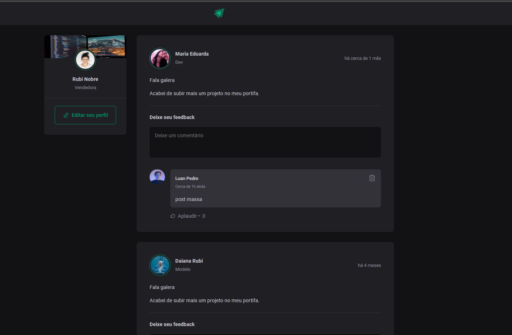

# Ignite Feed 

 Criando  Feed do Ignite, aplicação com frontend em React-js e TypeScript. 

## Como rodar a aplicação

1. baixe ou clone o projeto.
2. entre na pasta frontend, Instale as dependências usando o comando `npm install` ou `yarn`.

## Tecnologias utilizadas ##

- ReactJS
- Css
- Typescript